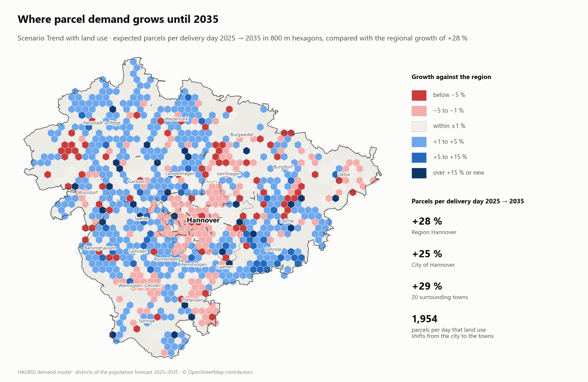
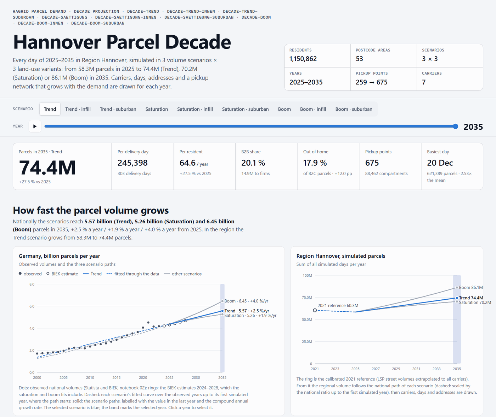
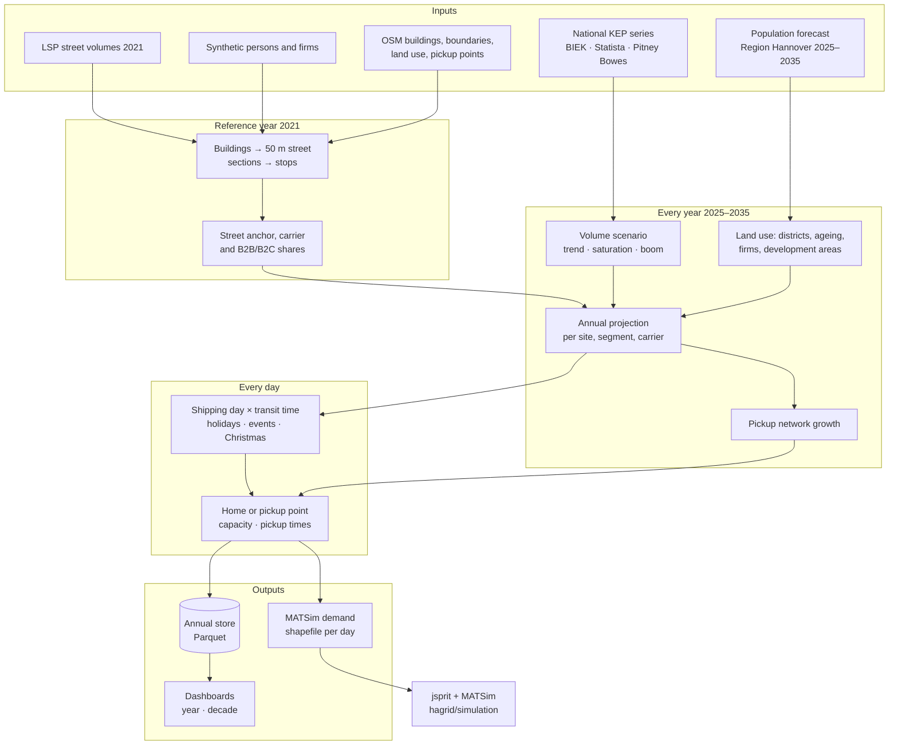
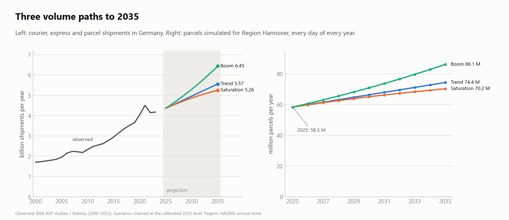
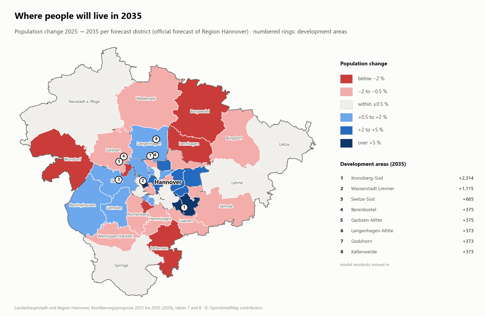
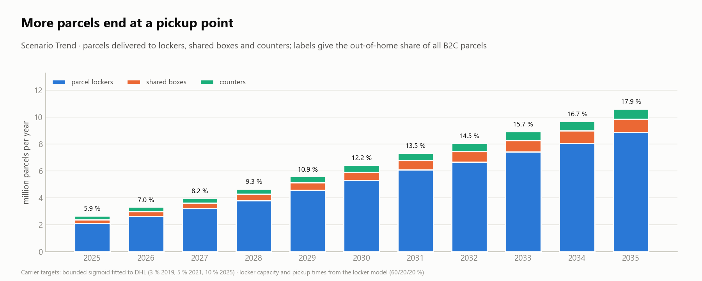
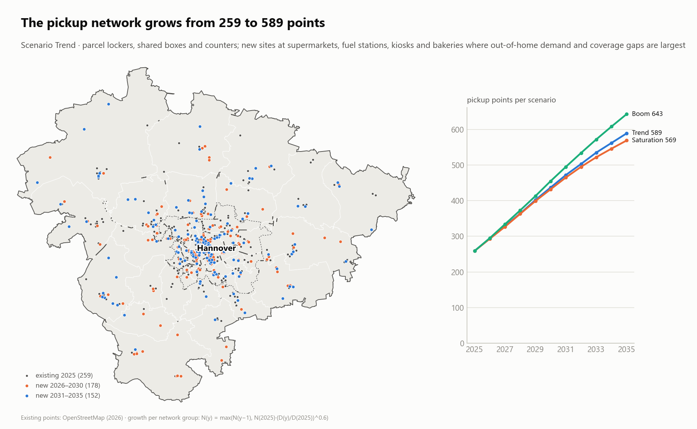
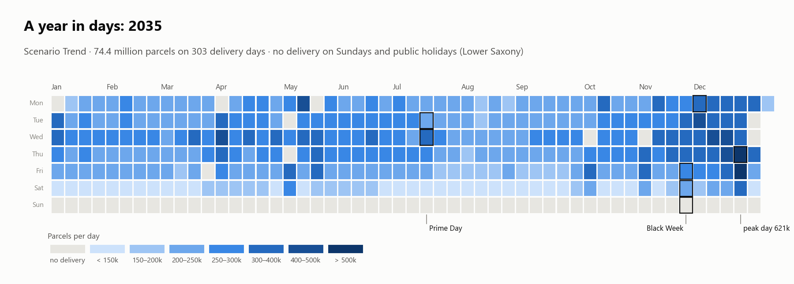
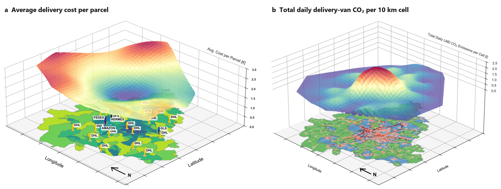

# HAGRID — Parcel demand and integrated freight/DRT simulation with MATSim

HAGRID is a research framework of the Institute of Transportation and Urban Engineering at TU Braunschweig for parcel
demand and last-mile logistics. It couples a parcel demand model with MATSim and jsprit simulations of delivery tours and
demand-responsive transport (DRT). Three research strands share one core:

| Strand | Question | Method | Headline |
|---|---|---|---|
| **[Hannover parcel demand 2025–2035](#6-hannover-demand-model-20252035)** | Where and when do parcels arise in the next decade? | Street-anchored demand model for every day of 2025–2035, three volume scenarios, land-use dynamics, a growing pickup network | 58 M parcels a year in 2025, 74 M in 2035 (trend); city and towns grow alike (+27.9 / +27.1 %) |
| **[Last-mile simulation and transport geography](#7-last-mile-simulation-and-batch-evaluation-hannover)** | What does a parcel cost to deliver, and where do the vans emit? | jsprit tours of all seven carriers simulated in MATSim; batch evaluation of delivery strategies and a vehicle-capacity sweep | €1.74 per parcel in the city, €2.88 in rural areas; the suburbs carry 60 % of the van kilometres and of the CO₂ |
| **[Lausitz: integrated passenger and parcel DRT](#8-lausitz-integrated-passenger-and-parcel-drt-hoyerswerda)** | Can one DRT fleet carry passengers and parcels in a rural region? | 100 % matsim-lausitz scenario of Hoyerswerda: baseline versus cargo hitching (1c) and capsule swap (1d) | At the same passenger service, cargo hitching needs about 138 vehicles and emits the same CO₂e as a DRT fleet plus separate delivery vans |

- **Core** — geo, demand and routing utilities, repository-root detection and simulation wiring (`hagrid.core`).

The separation is guarded by a source-scan test (`hagrid/simulation/src/test/java/hagrid/core/ArchitectureRulesTest.java`): it fails the build when `hagrid.hannover` and `hagrid.lausitz` reference each other, or when a `hagrid.core` class outside a four-class switchboard allowlist references a study package. It scans comment-stripped source text for package tokens, not the compiled dependency graph.

**The Hannover demand model** calibrates parcel demand to the carrier observations of 2021 (LSP street volumes,
population, firms and OSM buildings) and simulates it for **every day from 2025 to 2035** at **stop level**, with buildings
grouped along ~50 m street sections. It derives **carrier-level and B2B/B2C shares**, sends a growing part of the parcels
to **pickup points**, and lets demand follow **land-use change**: the population forecast per district, ageing, firm growth
and new development areas. Any simulated day can be exported for the last-mile simulation with jsprit and MATSim. The model supports the
analysis of future parcel traffic, the evaluation of delivery concepts and urban logistics infrastructure, and scenario
design for planning and policy. Its horizon ends in **2035**, the horizon of the official population forecast for Region
Hannover, and three national volume scenarios span the range of plausible growth instead of a single forecast.

<p align="center">
  <picture>
    <source media="(prefers-color-scheme: dark)" srcset="docs/images/demand/hexagon-change-dark.png">
    
  </picture>
</p>
<p align="center"><sub>Hannover demand model, trend scenario with land-use dynamics: where parcel demand grows faster (blue) or slower (red) than the region between 2025 and 2035. Details in <a href="#6-hannover-demand-model-20252035">section 6</a>.</sub></p>

## Table of Contents

1. [Overview & Key Features](#1-overview--key-features)
2. [Repository Structure](#2-repository-structure)
3. [Data Sources](#3-data-sources)
4. [Setup](#4-setup) (clone, freight submodule, inputs, runs)
5. [Installation (Python)](#5-installation-python)
6. [Hannover Demand Model 2025–2035](#6-hannover-demand-model-20252035) (method, scenarios, results, runs)
7. [Last-Mile Simulation and Batch Evaluation (Hannover)](#7-last-mile-simulation-and-batch-evaluation-hannover)
8. [Lausitz: Integrated Passenger and Parcel DRT (Hoyerswerda)](#8-lausitz-integrated-passenger-and-parcel-drt-hoyerswerda)
9. [Supported Output Formats](#9-supported-output-formats)
10. [Example Output](#10-example-output-one-simulated-day) (one simulated day)
11. [Limitations & Assumptions](#11-limitations--assumptions)
12. [License](#12-license)
13. [Contributing](#13-contributing)
14. [Contact](#14-contact)
15. [Project Status](#15-project-status)


## 1. Overview & Key Features

**Hannover demand model**

- **Time horizon**: every day of 2025–2035 for Region Hannover, calibrated to the reference year 2021
- **Granularity**: OSM buildings grouped into stops along ~50 m street sections; pickup points are stops of their own
- **Carriers**: DHL, Hermes, UPS, DPD, GLS, FedEx/TNT and Amazon Logistics, with market shares per year
- **B2B/B2C segmentation**: a declining national B2B share (bounded sigmoid) and carrier-specific B2B quotas, met exactly every year
- **Volume scenarios**: trend (linear), saturation (logistic) and boom (exponential) fits of the national series, chained at the 2025 level
- **Temporal model**: shipping day × transit time with seasonality, public holidays (Lower Saxony), Prime Day, Black Week, Singles' Day and the Christmas peak
- **Land-use dynamics**: population forecast per district, ageing with the life table and the forecast's age structure, a cohort effect on online shopping, firm growth by industry, development areas and new firms
- **Out-of-home delivery**: parcel lockers, shared boxes and counters with compartments, pickup times and a demand-driven growing network
- **Outputs**: annual store (Parquet), MATSim demand shapefiles for any day, standalone HTML dashboards for one year and for the decade

**Beyond the demand model**

- **Last-mile simulation (Hannover)**: jsprit tours per carrier simulated in MATSim, evaluated by area type, for batch delivery and in a vehicle-capacity sweep (section 7)
- **Lausitz study (Hoyerswerda)**: one DRT fleet for passengers and parcels, cargo hitching and capsule swap against a dedicated baseline (section 8)

## 2. Repository Structure

```
HAGRID/
├── README.md
├── pom.xml                    parent POM; modules: external/freight + hagrid/simulation
├── hagrid/
│   ├── demand/
│   │   ├── model/           Python package hagrid_demand: daily parcel demand 2025–2035, annual store, dashboards (see hagrid/demand/README.md)
│   │   ├── input/hannover/  git-ignored inputs (raw sources, OSM extracts, notebook outputs); tools/migrate-demand-input.ps1
│   │   ├── runs/            git-ignored model runs (year and decade runs: MATSim demand, annual store, dashboards)
│   │   └── archive/notebooks/{estimation,estimation-batch}/   the earlier notebook chain (superseded by model/)
│   └── simulation/            the single Maven module (packages hagrid.core / hannover / lausitz)
│       ├── src/main/java/hagrid/{core,hannover,lausitz}/…
│       ├── src/test/java/hagrid/{core,hannover,lausitz}/…
│       ├── input/{common,hannover,lausitz}/   git-ignored, see hagrid/simulation/input/README.md
│       ├── hagrid-output/
│       └── hagrid-matsim-output/
├── analysis/
│   ├── common/run-monitoring/
│   ├── hannover/{notebooks,sweep,legacy-figures}/
│   └── lausitz/{drt-headline,kpi}/
├── runs/
│   ├── hannover/           run_demand_year.bat, run_demand_decade.bat, run_analysis.bat, run_hagrid_sim*.bat, run_step*.bat, run_chain_v2dev.bat
│   └── lausitz/            track_sweep.ps1 and all other .bat/.ps1; one-off scripts under campaigns/
├── external/
│   ├── matsim-libs/        submodule (patched matsim-libs fork)
│   ├── freight/            POM shim
│   └── libs/               matsim-lausitz jar
├── tools/                  resync-freight.ps1, migrate-input-layout.ps1, check-run-scripts.ps1
├── requirements.txt
└── docs/                   project documentation; docs/images/demand/ holds the README figures
```

The tree shows tracked content only. Locally, `analysis/lausitz/` additionally holds `paper-figures/` (excluded via `.gitignore`) and `lmd/`; both are produced by simulation runs and are not versioned.

- `hagrid/` is an umbrella folder: `hagrid/demand/` holds the Python demand model (`model/`) and the archived notebook chain, `hagrid/simulation/` is the only Maven module. Java sources are organised along the three root packages `hagrid.core`, `hagrid.hannover` and `hagrid.lausitz`; inputs live under `hagrid/simulation/input/` (git-ignored).
- `analysis/` holds the Python analyses, split into `common` (cross-study, e.g. run monitoring), `hannover` and `lausitz`.
- `runs/` holds the Windows launch scripts, split by study; every script changes into the right directory itself.
- `external/` bundles third-party code: the `matsim-libs` fork as a submodule, the `freight` POM shim and the `libs` jars.
- `tools/` holds helper scripts for setup, migration and static checks that are not study-specific runs.
- `docs/` holds the living project documentation (backlog, methods log, study data, Obsidian export) and the Superpowers specs and plans; `docs/legacy/hagrid/` keeps the pre-restructure module documentation unchanged, for reference only.

`hagrid/demand/model/` is the current demand model (Python, tested): `runs/hannover/run_demand_year.bat` produces one year and hands the MATSim demand to `hagrid/simulation`, `runs/hannover/run_demand_decade.bat` simulates 2025–2035 in all scenarios. `hagrid/demand/archive/notebooks/` holds the Jupyter notebooks of the earlier Hannover demand estimation (`estimation/`; `estimation-batch/` is an older batch variant of the same chain); the model took its national series and profiles from them. `analysis/hannover/notebooks/` holds the older Hannover result-analysis notebooks used for the published papers; they carry absolute paths from the original author's machine and are kept as documentation of the analyses, not as a runnable pipeline. The paths in this paragraph are relative to the respective notebook folder, not to the repository root:

- **Notebooks 00–06** (under `hagrid/demand/archive/notebooks/estimation/`): each focuses on one part of the pipeline (global shares, B2B ratio, volumes, weekly distribution, local adaptations, and segment-level weighting).  
- **ParcelDemandScenarioGenerator.ipynb**: the final assembly that produces daily, segment-level demand.  
- **input/**: stores the notebooks' input data (e.g. shapefiles, CSVs, geospatial layers) — this is not `hagrid/simulation/input/`.  
- **output/**: default directory for exported results (CSV, SHP, GeoPackage, or GeoJSON).


## 3. Data Sources

- **Pitney Bowes Parcel Shipping Index (2023)**  
  Provides recent market shares (e.g. for 2022) and time-series changes since ~2016.

- **BIEK KEP Studies (2009–2023)**  
  Contains data on the composition of B2B vs. B2C shipments in Germany.

- **Statista & BIEK for Historical Parcel Volumes (2000–2013 / 2014–2028)**  
  Used to establish baseline annual parcel counts, including possible outlier handling (e.g. COVID effects).

- **Swiss Weekly Parcel Data (2019–2021)**  
  Used as a proxy for weekly fluctuations and seasonal delivery patterns in the absence of German data.  
  → Source: Gottschalk, F. & Lehmann, A. (2023). *Covid-19 and Swiss Post: Volume Developments and the Economic Value of Postal Service, in the Pandemic and Beyond.* In P. L. Parcu, T. J. Brennan & V. Glass (Eds.), *The Postal and Delivery Contribution in Hard Times* (pp. 207–222). Springer. https://doi.org/10.1007/978-3-031-11413-7_14

- **Local Geodata (Hannover)**  
  - Street network shapefiles or MATSim network  
  - Population and company locations derived from the MATSim Hanover model  
    → Source: Bienzeisler, L., Lelke, T., Wage, O., Thiel, F., & Friedrich, B. (2020). *Development of an Agent-Based Transport Model for the City of Hanover Using Empirical Mobility Data and Data Fusion.* Transportation Research Procedia, 47, 99–106. https://doi.org/10.1016/j.trpro.2020.03.073. Extended these datasets from follow-up developments of the MATSim Hanover Region model  
  - Carrier-specific parcel demand data (LSP street volumes of 2021, the anchor of the demand model – not publicly available)

- **Population Forecast Region Hannover (2026)**  
  Landeshauptstadt und Region Hannover: *Bevölkerungsprognose 2025 bis 2035*, tables 7 and 8 (30 forecast districts of the city, 20 towns and municipalities), table 5 (ten age groups of city and Umland) and table 11 (youth and old-age quotients per district). Drives the land-use dynamics and the age structure.

- **Destatis ICT Survey (2025)**  
  Share of persons who shopped online in the last 12 months by age group; used as the online-shopping propensity by age.

- **Eurostat ICT Survey (2008–2025)**  
  Online purchases by age group in Germany (`isoc_ec_ibuy`, `isoc_ec_ib20`); the pseudo-cohort fit gives the cohort effect (cohorts keep the online habit of their younger self).

- **Destatis Life Table 2021/2023**  
  General life table for Germany (table 12621-01); death probabilities by age for the ageing of the age mix.

- **Parcel Locker Counts (2020–2024)**  
  Official DHL Packstation counts (press releases: 6,500 at the end of 2020, 11,000 at the end of 2022, 14,500 in December 2024); calibrate how the pickup network grows with the out-of-home demand.

- **Region Hannover, *Trends und Fakten* (2025)**  
  Employment development 2014–2024; basis of the firm growth rates by industry.

- **OpenStreetMap** (© OpenStreetMap contributors, ODbL)  
  Buildings, administrative boundaries and land use (Geofabrik extract of 2021-01-01), parcel lockers and shops (Overpass, 2026), retail POIs as candidate sites for new pickup points.

- **Shipping Days and Pickup Behaviour**  
  Weekday profile of business senders from LogIKTram pickups; pickup-time profile at parcel lockers after Sailer, Klein & Steinhardt (2026), with mean pickup times by station context after Hovi et al. (2023) and Morganti et al. (2014).

- **Lausitz (Hoyerswerda)**  
  Scenario inputs, their provenance and licensing are documented in `docs/DATA-LAUSITZ.md`.


## 4. Setup

The freight module sources live in a git submodule (`external/matsim-libs`, a patched
fork of matsim-libs — see `docs/superpowers/specs/2026-07-13-freight-fork-submodule-design.md`).

**Fresh clone:**

```bash
git config --global core.longpaths true   # Windows only, required once
git clone --recurse-submodules https://github.com/TUBS-IVS/HAGRID.git
cd HAGRID
git -C external/matsim-libs sparse-checkout set contribs/freight examples/scenarios/logistics-2regions   # optional, trims ~1 GB of unrelated contribs
mvn install
```

**Existing clone (after pulling the submodule change):**

```bash
git submodule update --init external/matsim-libs
git -C external/matsim-libs sparse-checkout set contribs/freight examples/scenarios/logistics-2regions
```

**Bumping the MATSim/freight version:** see `tools/resync-freight.ps1` (header comment).

**Inputs:** `hagrid/simulation/input/` is git-ignored; its layout and provenance are described in `hagrid/simulation/input/README.md`.
A checkout whose local, git-ignored data still sit directly under `hagrid/` (inputs, `hagrid-output/`,
`hagrid-matsim-output/`, i.e. any clone updated before this change landed on `hendrik` on 2026-09-25) must run
`tools/migrate-input-layout.ps1` (no-op unless the pre-2026-09-17 layout is present) and then
`tools/migrate-module-layout.ps1` once, then build with `mvn -q clean install`. `clean` is
mandatory: the module directory changed and a stale `target/` would let `shade` pack both layouts.
`migrate-module-layout.ps1` writes a protocol with file counts and byte sums before and after to
`hagrid/simulation/logs/`; expect five `EQUAL` lines and `result=OK`. It renames first-level folders only,
but its preflight enumerates every file, so on a machine with 150 GB of runs allow tens of minutes. Rollback order:
`git checkout <previous commit>` first (git moves the tracked skeleton back), then
`tools/migrate-module-layout.ps1 -Reverse` (moves the ignored data back into it), then `mvn -q clean install`.

**Runs:** all launch scripts live under `runs/hannover/` and `runs/lausitz/`; they change into the
right directory themselves. `tools/check-run-scripts.ps1` checks them statically against the built jar.
`runs/hannover/run_hagrid_sim.bat` is the campaign reference copy; at runtime
`SimulationBatGenerator` writes the copy that is actually executed under `hagrid/simulation/`.

**IDE stale-build gotcha:** if Eclipse or VS Code's Java tooling has compiled a broken
workspace (e.g. mid-refactor), stale `.class` stubs left behind in `target/classes` can
shadow the fresh build output and produce confusing failures. `mvn clean` clears them out.

## 5. Installation (Python)

Clone the repository with its submodule; [Setup](#4-setup) above describes the full bootstrap (submodule sparse-checkout,
Windows long paths):

```bash
git clone --recurse-submodules https://github.com/TUBS-IVS/HAGRID.git
```

The demand model is a Python package (Python 3.11 or newer) with its own dependencies:

```bash
cd HAGRID/hagrid/demand/model
python -m pip install -e ".[test]"
python -m pytest -q
```

The analyses and the archived notebooks use the dependencies in the repository root (`requirements.txt` lives there, not in
the notebook folders):

```bash
cd HAGRID
pip install -r requirements.txt
```

The notebooks open from `hagrid/demand/archive/notebooks/estimation/`. Run them in order, `00_` to `06_`, followed by
`ParcelDemandScenarioGenerator.ipynb`.

## 6. Hannover Demand Model 2025–2035

The demand model lives in `hagrid/demand/model/` (Python package `hagrid_demand`, covered by pytest). It calibrates parcel
demand to the carrier observations of 2021 and simulates **every day of 2025–2035** for Region Hannover (1.15 million
residents, 53 postcode areas) at stop level. Every simulated day can be written in the format that the MATSim pipeline in
`hagrid/simulation` reads. Carrier and segment totals are exact in every year, and a run with land-use dynamics equals the
run without them in the base year 2025.

<p align="center">
  <picture>
    <source media="(prefers-color-scheme: dark)" srcset="docs/images/demand/dashboard-dark.png">
    
  </picture>
</p>
<p align="center"><sub>The decade dashboard, one standalone HTML file: scenarios, carriers and channels, postcode map, growth
hotspots, structural change, the hexagon change map, the pickup network and a calendar of every day.</sub></p>

### 6.1 Pipeline



### 6.2 Method

1. **Reference year 2021: buildings, stops and the street anchor.** Synthetic persons are placed in OSM buildings (state of
   2021-01-01), firms in matching buildings of their 100 m census cell. Every building gets its street from the LSP data, its
   50 m section and its street side. The observed LSP street volumes of 2021 set the parcel rates per resident and firm and split every street into
   B2C and B2B; the other carriers follow their market and B2B shares. Buildings on the same street side within 2 × 40 m form
   one stop, large receivers (at least 15 parcels a day) a stop of their own. The reference holds 60.3 million parcels on 306
   delivery days.
2. **National volume, market and B2B share.** The national KEP series (2000–2023) is fitted linearly (**trend**),
   logistically (**saturation**) and exponentially (**boom**). Every path is chained at the calibrated 2025 level, so the
   scenarios share 2025 and differ only in their slope. Market shares, the national B2B share (bounded sigmoid) and the B2B
   quotas per carrier come from the notebook series.
3. **Land-use dynamics.** Persons follow the official population forecast 2025–2035 in 49 forecast districts (city districts
   and surrounding towns). Two variants shift growth towards the city (infill) or the towns (suburban). The age mix ages by one
   year per year with the Destatis life table and is fitted every year to the forecast's age groups (under 18, 18–64 and
   65+ per district, ten groups for city and Umland). The online-shopping propensity by age (Destatis 2025) keeps a full
   cohort effect, estimated from the Eurostat ICT series 2008–2025: a cohort keeps the propensity of its younger self. Firms grow by industry, from +1.5 % a year (health) to −0.5 % (manufacturing). Eight
   development areas (Kronsberg-Süd, Wasserstadt Limmer, Seelze-Süd and five in Langenhagen and Garbsen) and new firms in
   commercial areas become new sites with stops of their own. Land use redistributes the regional volume and never changes it.
4. **Annual projection.** For every year, site, segment and carrier, the expected parcels follow from the reference shares,
   weighted with the land-use factors and scaled to the regional totals of the scenario.
5. **Days: shipping day × transit time.** Orders ship with a seasonal factor per calendar week (Swiss Post 2019–2021) and a
   weekday profile, and arrive one, two or three delivery days later (85/13/2 %). Nothing ships on public holidays; the backlog
   spreads over the next three shipping days. Christmas orders are pulled forward, and 24 and 31 December deliver half a day.
   Prime Day (Amazon ×2.0), Black Week (×1.35) and Singles' Day (×1.15) lift B2C orders while every carrier keeps its annual
   volume. Only 20 % of firms accept parcels on Saturdays. Weekly and daily shocks per segment and carrier make days differ;
   the annual totals stay exact.
6. **Space: homes and pickup points.** B2B parcels go to firms and B2C parcels to homes, each with the carrier mix of its
   segment; frequent receivers vary by a factor per site. A growing share of B2C parcels goes to parcel lockers, shared boxes
   and counters, along a bounded sigmoid per carrier (DHL: 5 % in 2021, 10 % in 2025). Recipients choose among the three
   nearest points within 1.5 km. Lockers have compartments (from OSM or sized by demand, up to 390), and every parcel draws a
   pickup class: 60 % leave on the day of delivery, 20 % on the next and 20 % on the second day (after Sailer, Klein &
   Steinhardt 2026). A full locker passes the parcel to the next point or back to the door.
7. **Growing pickup network.** Before the day loop, a pre-pass adds points to every network group (DHL Packstation, Amazon
   Locker, shared boxes, Amazon counters): N(y) = max(N(y−1), round(N(2025) · (D(y)/D(2025))^0.6)), where D is the
   out-of-home demand of the group. New sites are drawn among supermarkets, fuel stations, kiosks and bakeries, weighted by the
   B2C demand within 500 m and the gap to the nearest point of the group. The rest of the demand growth goes into larger
   lockers.
8. **Outputs.** The annual store keeps every day of every year as Parquet (`stop_daily`, `plz_daily`, `point_daily`,
   `locker_occupancy`). MATSim demand shapefiles are written for the configured days, and `export-day` writes any other day
   from the store. The annual dashboard and the decade dashboard are standalone HTML files.

The 2025 run reproduces the private weekday profile of the notebook chain within 0.2 percentage points and follows the Swiss weekly
series with a correlation of 0.94. All assumptions with their sources, the acceptance runs and the configuration keys are
documented in [`hagrid/demand/model/README.md`](hagrid/demand/model/README.md); the specifications and plans are
in [`docs/demand/`](docs/demand/).

### 6.3 Scenarios and results

|  | 2025 | 2035 · Trend | 2035 · Saturation | 2035 · Boom |
|---|---:|---:|---:|---:|
| National KEP shipments per year | 4.37 bn | 5.57 bn | 5.26 bn | 6.45 bn |
| Parcels in Region Hannover per year | 58.3 M | 74.4 M | 70.2 M | 86.1 M |
| Parcels per delivery day | 192k | 245k | 232k | 284k |
| Parcels per resident and year | 50.7 | 64.6 | 61.0 | 74.8 |
| B2B share | 21.5 % | 20.1 % | 20.1 % | 20.1 % |
| B2C parcels delivered to pickup points | 5.9 % | 17.9 % | 17.9 % | 17.9 % |
| Pickup points (lockers, shared boxes, counters) | 259 | 675 | 649 | 749 |
| Parcels on the busiest day | 421k | 621k | 586k | 720k |

<p align="center">
  <picture>
    <source media="(prefers-color-scheme: dark)" srcset="docs/images/demand/volume-scenarios-dark.png">
    
  </picture>
</p>

The scenarios span the plausible range and are not a forecast with a confidence interval. In the region the trend scenario
reaches 70 million parcels a year in 2033, saturation in 2035 and boom in 2030; only boom passes 80 million (2034).

### 6.4 Land use: where demand moves

The hexagon map at the top shows the trend scenario against its regional growth of +27.5 %: the city of Hannover grows by
+27.9 %, the 20 surrounding towns by +27.1 %. Its colours count hexagons: many outer city hexagons grow faster than the
region, while the dense inner core, which carries a third of the city's parcels, grows slower. By 2035 land use moves about 440 parcels a day from the towns to the city: the
city's share of the demand rises from 44.1 % to about 44.3 %, and the two variants move it to 44.6 % (infill) or 43.9 %
(suburban), in each of the three volume scenarios alike. The official age structure decides this: the towns lose many 45- to 64-year-olds with a high online
propensity (−11.8 % by 2034), the city only −4.8 %, while both gain 65- to 74-year-olds who keep their online habit.

<p align="center">
  <picture>
    <source media="(prefers-color-scheme: dark)" srcset="docs/images/demand/districts-population-dark.png">
    
  </picture>
</p>

### 6.5 Pickup points and every day of the year

<p align="center">
  <picture>
    <source media="(prefers-color-scheme: dark)" srcset="docs/images/demand/out-of-home-dark.png">
    
  </picture>
</p>

<p align="center">
  <picture>
    <source media="(prefers-color-scheme: dark)" srcset="docs/images/demand/pickup-network-dark.png">
    
  </picture>
</p>

<p align="center">
  <picture>
    <source media="(prefers-color-scheme: dark)" srcset="docs/images/demand/calendar-dark.png">
    
  </picture>
</p>

### 6.6 Running the model

Inputs are git-ignored (`hagrid/demand/input/hannover/`, layout in [`hagrid/demand/README.md`](hagrid/demand/README.md)); the
LSP street volumes are not public. Install and test from `hagrid/demand/model`:

```powershell
cd hagrid/demand/model
python -m pip install -e ".[test]"
python -m pytest -q
```

From the repository root:

```bat
runs\hannover\run_demand_year.bat demand-2025
runs\hannover\run_demand_decade.bat trend trend-innen trend-suburban saettigung saettigung-innen saettigung-suburban boom boom-innen boom-suburban
```

The year run simulates 2025 with its annual dashboard and copies the MATSim demand to
`hagrid/simulation/input/hannover/demand/<run-id>/`. The decade run simulates 2025–2035 for every scenario (about 30 minutes
and 7 GB each including the stage cache; the trend configuration exports eight days per year and takes about 80 minutes) and renders `hagrid/demand/runs/decade_dashboard.html`. Further commands:

```powershell
python -m hagrid_demand baseline export-day --run hagrid/demand/runs/decade-trend --date 2035-06-05
python -m hagrid_demand baseline decade-dashboard --run trend=hagrid/demand/runs/decade-trend --run boom=hagrid/demand/runs/decade-boom --out decade.html
python docs/images/demand/make_figures.py --dashboard hagrid/demand/runs/decade_dashboard.html --out docs/images/demand
```

The last command renders the figures of this README from the decade dashboard.

### 6.7 Notebook workflow (archived)

`hagrid/demand/archive/notebooks/` holds the earlier Jupyter chain (00–06 and `ParcelDemandScenarioGenerator.ipynb`, see
section 2); the model took its national series and profiles from it.

Each notebook builds on the results of the previous ones. The general workflow moves from national-level parcel data to localized, street-level demand estimations for each day and carrier.

---

## 7. Last-Mile Simulation and Batch Evaluation (Hannover)

A simulated day of the demand model feeds `hagrid/simulation` (package `hagrid.hannover`): jsprit plans the tours of every
carrier from its hubs, MATSim simulates them on the Hannover network, and `hagrid_output_analysis` derives vehicle
statistics, costs, EV assignment and emissions for one run or a batch (`runs/hannover/run_hagrid_sim.bat`,
`run_analysis.bat`). Three studies build on it:

- **Transport geography of parcel delivery** (*Journal of Transport Geography*): 222,693 parcels in 1,715 tours on a
  reference day, by area type; delivering a parcel costs €1.74 in the city and €2.88 in rural areas, and the suburbs carry
  60 % of the van kilometres and of the CO₂. Companion notebook:
  [`analysis/hannover/notebooks/journal-of-transport-geography-paper/`](analysis/hannover/notebooks/journal-of-transport-geography-paper/).
- **Batch delivery**: recipients bundle parcels on fewer days when fast delivery costs extra; scenarios compared with the
  base case over a week (`analysis/hannover/notebooks/result-analysis-batch-*.ipynb`).
- **Vehicle-capacity sweep** (Hendrik Bimmermann): 97 runs from 30 to 400 parcels per van with an interactive board
  ([`analysis/hannover/sweep`](analysis/hannover/sweep)).

<p align="center">
  
</p>

## 8. Lausitz: Integrated Passenger and Parcel DRT (Hoyerswerda)

The Lausitz study (Hendrik Bimmermann) tests whether one demand-responsive fleet can carry passengers and parcels in a
rural area. In the 100 % matsim-lausitz scenario of Hoyerswerda, a baseline (DRT minibuses plus separate delivery vans)
is compared with **cargo hitching** (1c, passengers and parcels on board at once) and a **capsule swap** (1d, a passenger
or a cargo capsule on the same driveboard). At the baseline's passenger service, cargo hitching needs about 138 vehicles
and emits the same CO₂e as the baseline's DRT fleet plus 41 vans. KPI pipeline:
[`analysis/lausitz/kpi`](analysis/lausitz/kpi); decisions and findings: [`docs/METHODS-LOG.md`](docs/METHODS-LOG.md);
inputs: [`docs/DATA-LAUSITZ.md`](docs/DATA-LAUSITZ.md); runs: `runs/lausitz/`.

## 9. Supported Output Formats

The demand model writes:

- **MATSim demand shapefiles** (`.shp`, EPSG:25832) – one file per delivery day, one point per stop with the parcels per
  carrier and segment (section 10)
- **Annual store** (`.parquet`) – every day of every simulated year per stop, postcode, pickup point and locker
- **Registers** (`.parquet`, GeoParquet) – annual projection per site, pickup network per year, land-use districts, factors
  and new sites
- **Dashboards** (`.html`) – standalone annual and decade dashboards, readable offline

The archived notebook generator exported CSV (geometry as WKT), Shapefile, GeoPackage and GeoJSON.

## 10. Example Output: One Simulated Day

`hagrid_parcel_demand_2035-05-11_(Friday).shp` from the trend scenario holds 51,006 stops with 232,209 parcels. Each row is one
stop, a group of buildings on one street side or a pickup point; all parcels of that stop are split by carrier and by
B2C/B2B in the same row.

| Column | Description |
|---|---|
| `id`, `stop_id` | Row and stop ID; stops above 400 parcels are split over several rows |
| `str_idx`, `section_id` | Street index and 50 m section of the stop (`-1` for pickup points and off-street buildings) |
| `postal_cod` | Postcode |
| `date` | Simulation date |
| `<carrier>_tag`, `<carrier>_type` | B2C and B2B parcels per carrier (`dhl_tag`, `dhl_type`, …; DBF names have at most 10 characters) |
| `dhl_b2c` … `ups_b2b` | The same values under the column names of the notebook generator (`ama_`, `dhl_`, `dpd_`, `fxt_`, `gls_`, `her_`, `ups_`) |
| `total`, `total_sim`, `wl_tag` | Parcels of the row |
| `stop_type` | `home`, `locker`, `shared_locker` or `counter` |
| `geometry` | Point in EPSG:25832 |

Two rows from that file, a building stop (here a firm with only B2B parcels) and a DHL Packstation:

| `stop_id` | `stop_type` | `str_idx` | B2B parcels (`<carrier>_type`) | B2C parcels (`<carrier>_tag`) | `total` |
|---|---|---:|---|---|---:|
| `stp:5ca96df7b827853c` | `home` | 6774 | DHL 68, UPS 33, DPD 11, FedEx 9, GLS 9, Hermes 3 | – | 133 |
| `ooh:osm:n10075369481` | `locker` | −1 | – | DHL 45 | 45 |

The files load directly into QGIS or ArcGIS, and `hagrid/simulation` reads them for jsprit and MATSim.

## 11. Limitations & Assumptions

- **Aggregate Land-Use Dynamics:**  
  Persons follow the official forecast per district and firms grow by industry. Households, housing stock, incomes and
  commuting are not modelled, and the residents, timing and location of the development areas are assumptions.

- **Carrier Landscape Stability:**  
  The model assumes a consistent set of parcel carriers throughout the projection period. Emerging or disappearing carriers are not explicitly modeled.

- **Synthetic Localization:**  
  One LSP is anchored to its observed 2021 street volumes. The other carriers follow their market and B2B shares on the same
  sites, calibrated with available references and spatial proxies, not with complete ground-truth data.

- **Weekly and Seasonal Patterns:**  
  The seasonal factor per calendar week comes from Swiss Post data (2019–2021) and includes the effects of COVID-19.
  Public holidays of Lower Saxony, shipping and transit days, the Christmas peak and sales events are modelled explicitly.

- **Parcel Growth Modeling:**  
  National volume follows three fitted paths chained at the 2025 level, and nothing is projected beyond 2035. The spread
  between the paths is the scenario range, not a statistical confidence interval.

- **Pickup Behaviour:**  
  Pickup times, the choice among nearby points and the sizing of compartments are literature-based assumptions, not local
  measurements. Synthetic sites stand in for partner shops and counters missing from OSM.

- **Data Availability:**  
  Some internal data (e.g. LSP reference volumes) are not publicly available and must be substituted or removed in open use.

- **Lausitz study:**  
  Methodological decisions, known limitations and retracted findings of the DRT/freight study are recorded in `docs/METHODS-LOG.md`; this README does not repeat them.

## 12. License

This project is licensed under the **Creative Commons Attribution 4.0 International (CC BY 4.0)** license.

You are free to:
- **Share** — copy and redistribute the material in any medium or format
- **Adapt** — remix, transform, and build upon the material for any purpose, even commercially.

Under the following terms:
- **Attribution** — You must give appropriate credit, provide a link to the license, and indicate if changes were made.

Full license text:  
[https://creativecommons.org/licenses/by/4.0/](https://creativecommons.org/licenses/by/4.0/)


## 13. Contributing

Contributions are welcome and encouraged!

If you would like to suggest improvements, report issues, or add new features:

1. Fork the repository
2. Create a new branch
3. Make your changes and commit them
4. Open a Pull Request with a clear description

For larger changes or questions, feel free to open an Issue beforehand to discuss your ideas.

---

## 14. Contact

**Maintainer:** Dr.-Ing. Lasse Bienzeisler  
**Lausitz study and capacity sweep:** Hendrik Bimmermann  
**Institution:** Technische Universität Braunschweig, Institut für Verkehr und Stadtbauwesen  
**Email:** l.bienzeisler@tu-braunschweig.de  
**Website:** [https://www.tu-braunschweig.de/ivs](https://www.tu-braunschweig.de/ivs)

---

## 15. Project Status

HAGRID is under active development. Data structures, model parameters and results may change as the methods are refined;
the demand model records its design decisions in the specifications under [`docs/demand/`](docs/demand/), the Lausitz study
in [`docs/METHODS-LOG.md`](docs/METHODS-LOG.md). Feedback and issues are welcome.

We hope HAGRID helps researchers, logistics planners and data scientists to understand and simulate parcel flows in the
Hannover region and integrated passenger and parcel DRT services in rural areas. If you find it useful, please star the
repository and share it with others working on urban logistics and long-term scenario planning.
