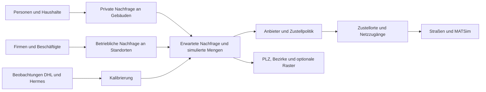

# HAGRID Demand v2: Modell- und Projektentwurf

**Einordnung:** Früherer Detailentwurf. Maßgeblich ist jetzt der [Gesamtentwurf](C:/Users/bienzeisler/Documents/GitHub/HAGRID/docs/demand-audit/MASTERPLAN.md). Die hier beschriebenen Modellfamilien und Haushaltsannahmen sind Kandidaten, keine festgelegte Implementation.

**Status: Spezifikation für den Neubau, noch keine implementierte Demand-Pipeline.** Der Entwurf verwendet die vorhandenen Inputs als Ausgangspunkt. Zusätzliche Daten verbessern Kalibrierung und Aktualität, sind aber keine Voraussetzung für eine erste transparente Szenarioversion.

**Präzisierung nach PANDA-Review:** Der [gemeinsame Hybridansatz](C:/Users/bienzeisler/Documents/GitHub/HAGRID/docs/demand-audit/PANDA_HAGRID_CONCEPT.md) konkretisiert die Modellwahl. Bevölkerung plus Wohnstruktur wird zuerst als Referenz reproduziert; der Haushaltsansatz unten ist eine zu prüfende Erweiterung. Anbieterprofile und DHL-Beobachtungsmodell werden gemeinsam kalibriert, nicht nur nachträglich auf eine vermeintlich bekannte Gesamtverteilung angewandt.

## 1. Ziel und fachliche Grenze

Geschätzt werden **eingehende Paketsendungen zu Empfängern in der Region Hannover**, nach Datum, Empfängertyp und optional Anbieter. Heute bedeutet im aktuellen Arbeitsstand **9. September 2026**. Ohne aktuelle lokale Messung ist das eine auf einen historischen Stand fortgeschriebene Schätzung, keine beobachtete Tagesnachfrage.

Das System liefert drei unterschiedliche Produkte:

| Produkt | Zweck | Ergebnis |
|---|---|---|
| Baseline-Rekonstruktion | Modell und Raumverteilung am historischen Referenzstand prüfen | Erwartete Mengen für den genau definierten DHL-/Hermes-Beobachtungszeitraum |
| Aktuelle Schätzung | Strukturstand und Intensitäten auf 2026 fortschreiben | Tages-/Jahreserwartung und Bandbreiten mit ausgewiesenem Datenalter |
| Zukunftsszenarien | Entwicklung etwa bis 2030/2035 und optional 2050 untersuchen | Mehrere gemeinsame Pfade für Bevölkerung, B2B, B2C, Anbieter und Logistikpolitik |

Primäre Modellgrößen sind **Paketmengen**, nicht Lieferstopps, Fahrzeuge oder Lkw-Verkehr. Beschäftigtenzahl und Branche sind Merkmale für Paketempfang; sie dürfen nicht unbesehen gesamte betriebliche Güterverkehre repräsentieren. Ausgehende Sendungen, Retourenabholungen, C2C, internationale Zu-/Abflüsse und Eigenzustellung müssen in einer gemeinsamen Marktabgrenzung ausdrücklich ein- oder ausgeschlossen werden.

Die Bezeichnung B2B/B2C verlangt einen Datenvertrag: Sind in allen Quellen tatsächlich geschäftliche Absender und Empfänger unterschieden, oder wird nur zwischen Geschäfts- und Privatempfängern getrennt? Bis dies geklärt ist, sollte das interne Feld `recipient_type = business | private` heißen; eine abweichende KEP-Definition darf nicht stillschweigend gleichgesetzt werden.

## 2. Räumliches Grundmodell ohne verpflichtendes 250-m-Raster

**Vorschlag:** Nachfrage auf Gebäuden beziehungsweise geokodierten Betriebsstandorten modellieren; Haushalte und Betriebe sind die darunterliegenden Nachfrageeinheiten. Zustellzugänge und Straßensegmente dienen der Logistikzuordnung. Raster sind frei wählbare Aggregationen.



Das vorhandene `Building` ist eine Kennung, noch kein verifizierter Hauseingang. In Stage 01 wird geprüft, ob eine Kennung konsistente Koordinaten hat, ob mehrere IDs dieselbe Position repräsentieren und ob Firmenkoordinaten reale Standorte oder synthetische Zuordnungen sind. Mehrere Haushalte am gleichen Gebäude bleiben mehrere Nachfrageeinheiten; sie teilen sich lediglich den Zustellort.

Jede Einheit erhält genau einen primären Standort. Für unsichere räumliche Zuordnungen sind anteilige Gewichte möglich, deren Summe je Einheit 1 sein muss. Ein Bahnhof, eine Parallelschiene oder eine nicht befahrbare Straße wird nicht allein aufgrund euklidischer Nähe zum Zustellzugang. Netz-Mapping benötigt zulässige Links, Reichweiten und einen eindeutigen Tie-Break.

| Alternative | Verwendung | Nachteil |
|---|---|---|
| Gebäude-/Standortpunkte | Empfohlener Nachfrage-Support | Standortfehler und fehlende Haushaltsmerkmale müssen sichtbar bleiben |
| Straßensegmente mit eindeutigen Einzugsgebieten | Rückfalloption, wenn Standortqualität zu schwach ist | Ergebnis hängt an Straßennetz und Segmentierung |
| 250-m-, 100-m- oder Hexagonraster | Karten, Berichte, Vergleich zum Altmodell, gegebenenfalls räumliche Glättung | Auflösungswechsel erzeugt keine neuen Informationen |

Vor allem müssen Gebiete mit alten Nullmengen und heutigen Einwohnern/Firmen eine positive Erwartung erhalten können. Ein fehlender DHL-Wert ist kein Beweis für fehlende Gesamtmarktnachfrage.

## 3. B2C aus privaten Nachfrageeinheiten

Die erste Version braucht kein komplexes Modell je Einzelperson. Für bekannte Haushalte h wird eine Jahresintensität angesetzt:

\[
\log \lambda^{C}_{h,y}
= a_C + f(\text{Haushaltsgröße}_h)
+ \beta_C^\top x_h + u_{r(h)} + g^C_y.
\]

Dabei enthält x nur tatsächlich verfügbare und fachlich begründbare Haushaltsmerkmale, beispielsweise Alterszusammensetzung. Einkommen oder Kaufkraft sind im geprüften Personen-Schema nicht als gesicherte Inputs vorhanden und werden nicht als bekannt vorausgesetzt. Regionalparameter werden stark regularisiert; mehr Parameter sind nur bei unabhängiger Validierungsverbesserung sinnvoll.

Für die **536.496 Personen ohne Haushaltskennung**:

1. Personen am Gebäude sammeln, bekannte Haushaltszugehörigkeiten erhalten.
2. Fehlende Haushaltsstruktur aus beobachteten Verteilungen in vergleichbaren Gebieten mehrfach imputieren, wenn deren Repräsentativität geprüft ist.
3. Alternativ direkt einen getrennten personenbasierten Nachfragebeitrag am Gebäude berechnen. Dieser wird nur für die nicht bereits einem bekannten Haushalt zugeordneten Personen verwendet.
4. Herkunft markieren: `known_household`, `imputed_household` oder `person_fallback`.

Ein Gebäude ist nicht automatisch ein Haushalt. Eine einzige globale mittlere Haushaltsgröße wäre ein transparenter Start-Prior, müsste aber als unsichere Annahme ausgewiesen werden. Mehrfachimputation darf die bekannten Personen-/Gebäudebestände nicht verändern und keine zusätzliche Bevölkerung erzeugen.

Gebäudeerwartung ist die Summe seiner Haushaltserwartungen und gegebenenfalls Ersatzbeiträge. Wo Messdaten fehlen, beginnt das Modell mit wenigen Intensitätsparametern und einer nachvollziehbaren Normierung auf ein regionales Privatkundenvolumen.

## 4. B2B aus Branche, Betriebsgröße und Aktivität

Für Betrieb j mit Branche k und Beschäftigtenzahl E lautet ein geeigneter **zu prüfender Modellansatz**:

\[
\log \lambda^{B}_{j,y}
= a_{k(j)} + \gamma_{k(j)}\log(1+E_{j,y})
+ u_{r(j)} + g^{B}_{k(j),y}.
\]

Die positive Intensität beschreibt eingehende Pakete pro Jahr. Der Intercept bildet auch einen Grundbedarf kleiner Betriebe ab; der Größenexponent lässt nichtlineare Zusammenhänge zu. Branchen mit wenigen Beobachtungen werden zu gemeinsamen Gruppen zusammengefasst oder in Richtung eines gemeinsamen Mittelwerts regularisiert. Die 19 vorhandenen `branch`-Werte werden zuerst fachlich entschlüsselt; eine WZ-Kodierung wird nicht unterstellt.

Sinnvolle Entwicklungsschritte:

| Modell | Umfang | Wann verwenden? |
|---|---|---|
| B0 | Betriebe + Beschäftigte mit wenigen positiven Koeffizienten | Transparente Referenz, um Verbesserungen zu messen |
| B1 | Branchengrundbedarf und größenabhängige Intensität mit Regularisierung | Empfohlener erster fachlicher Neubau |
| B2 | Hierarchische Regional-/Brancheneffekte und größenabhängige Varianz | Wenn räumliche Testdaten zusätzliche Komplexität tragen |
| B3 | Aktivitätstage und Sendungsbündel je Betrieb | Wenn tägliche B2B-Beobachtungen oder belastbare Priors verfügbar sind |

Aus dem Verhältnis der beiden geschätzten Mengen ergibt sich der lokale Geschäftsanteil:

\[
b_{r,y} = \frac{\sum_{j\in r}\lambda^B_{j,y}}
{\sum_{j\in r}\lambda^B_{j,y}+\sum_{h\in r}\lambda^C_{h,y}}.
\]

Damit kann der Anteil sinken, obwohl die absolute B2B-Menge wächst, wenn B2C schneller wächst. Eine vorgegebene 20-%-Untergrenze ist nicht mehr Bestandteil der Modellstruktur. Unterschiedliche Branchen können über die Jahre wachsen, stagnieren oder schrumpfen.

**Identifikationsgrenze:** DHL-Gesamtmengen allein trennen Firmen- und Privatkundenintensitäten nicht eindeutig. Unterschiedliche B2B-/B2C-Kombinationen können dieselben Straßenmengen erklären. Nationale Anteile, Anbieterwissen und Legacy-Zellen können als unsichere Priors helfen; sie ersetzen keine unabhängigen lokalen B2B-Messungen. Ein höher aufgelöstes Modell soll diese Ungewissheit abbilden, nicht durch viele Dezimalstellen verdecken.

## 5. Gesamtvolumen, Anbieter und Beobachtungen gemeinsam richtig behandeln

### 5.1 Lokale Gesamtmenge vom Anbieteranteil entkoppeln

Für einen einfachen Übergangsfall kann das regionale Basisvolumen aus Beobachtung und Basisjahranteil entstehen:

\[
V_{r,y_0} \approx D_{r,y_0}/s^{DHL}_{r,y_0},\qquad
V_{r,y}=V_{r,y_0}G_{r,y}.
\]

Erst danach wird `s_DHL(r,y)` auf `V(r,y)` angewandt. Eine Änderung des Anbieteranteils verändert die Verteilung auf Anbieter, nicht zusätzlich das zuvor festgelegte Gesamtvolumen. Weil der Basisanteil unsicher ist, muss seine Unsicherheit bereits in `V(r,y0)` eingehen.

Für das bessere Modell werden räumliche Intensitäten und wenige Anbieterparameter gemeinsam gegen Beobachtungsaggregate angepasst. Für Beobachtung o gilt sinngemäß:

\[
\widehat m_o = \sum_{d\in T_o}\sum_{i,s,c}
A_{o,i,c,d}\,p_{c\mid i,s,y(d)}\,\mu_{i,s,d}.
\]

`A` beschreibt Gebiet, Anbieterabdeckung und Messdefinition. Bei Tagesdurchschnitten wird durch die tatsächliche Zahl relevanter Beobachtungstage geteilt; bei Jahressummen nicht. Ohne geklärten Nenner darf die Hermes-Umrechnung durch 26 nicht übernommen werden. Unterschiedliche Einheiten werden nicht in eine gemeinsame Verlustfunktion geworfen.

### 5.2 Kalibrierungsproblem

Vorgeschlagen wird eine gemeinsame Zielfunktion aus:

- Beobachtungsabweichung, gewichtet nach Messunsicherheit und Abdeckung;
- Regularisierung der Branchen-/Gebietsparameter;
- weich gewichteten nationalen B2B-/Marktinformationen;
- gegebenenfalls zeitlicher Glättung aufeinanderfolgender Parameter.

Zuerst wenige Parameter, keine individuellen freien Zellfaktoren. Für Zählbeobachtungen kann eine Poisson- oder Negative-Binomial-Likelihood verglichen werden. Für Mittelwerte mit bekannter Messstreuung ist eine entsprechend gewichtete Beobachtungsmodellierung geeigneter. Kein Count-Modell auf eine unbekannte Einheit fitten.

Harte Randbedingungen betreffen echte Bilanzen und Zulässigkeit: Nichtnegativität, Anbieteranteile mit Summe 1 und eindeutige Zuordnungen. Unsichere Marktstudien und die Übertragung eines Deutschlandanteils auf Hannover sind weiche Informationen. Unvereinbare harte Vorgaben müssen einen erklärbaren Fehler erzeugen, keine stille Reparatur.

### 5.3 Anbieterzuordnung

Anbieterwahrscheinlichkeiten können als regularisierte Softmax-Funktion von Empfängertyp, Branche und Region beschrieben werden. In einer ersten Version genügen wenige Gruppen. Die nationale Anbieterstruktur wirkt als Prior; vorhandene DHL-/Hermes-Beobachtungen aktualisieren sie lokal. Anbieter ohne Beobachtungen bleiben stärker priorgetrieben.

Einheitliche Carrier-IDs, aktive Anbieter je Jahr und gegebenenfalls eine explizite Restkategorie verhindern willkürliches Entfernen kleiner Anteile. Firmen erhalten in mehreren Tagen nicht zwingend unabhängig neu gezogene Anbieter: Ein beständiger Standort-/Vertragsanteil kann mit einer variablen Sendungskomponente kombiniert werden. Auch diese Beständigkeit ist ohne Messdaten zunächst eine Szenarioannahme.

## 6. Zeitmodell und Schwankungen

### 6.1 Zuerst Kalender, dann Volumenverteilung

Es gibt eine tägliche Datumstabelle mit Kalenderjahr, ISO-Jahr, ISO-Woche, Wochentag, lokalen Feiertagen und Ereignismerkmalen. B2B und B2C dürfen verschiedene Profile haben. Die Schweizer Reihe ist eine initiale Saisonalitätsinformation mit Übertragungsunsicherheit; deutsche Feiertage und Ostern werden nicht durch starre Schweizer Kalenderwochen ersetzt.

Für Jahresintensität `lambda(i,s,y)` und positive Kalendergewichte `w(s,d)`:

\[
\mu_{i,s,d}=\lambda_{i,s,y(d)}
\frac{w_{s,d}}{\sum_{t\in y(d)}w_{s,t}}.
\]

So summieren sich tägliche Erwartungen exakt zur Jahreserwartung. Die Normierung wird über das ganze Kalenderjahr vorgenommen, auch wenn nur eine Woche exportiert wird. Geänderte Exportzeiträume dürfen nicht die Tageserwartung verändern.

Nachfrageentstehung kann am Sonntag positiv sein, während ein Zustellkalender an diesem Tag null Zustellungen vorsieht. Für eine reine Zustellnachfrage-Baseline kann zunächst direkt ein Zustellprofil modelliert werden; beide Definitionen dürfen im selben Datensatz nicht verwechselt werden.

### 6.2 Drei Unsicherheitsebenen

| Ebene | Beispiel | Ziehung und Wirkung |
|---|---|---|
| Parameter-/Datenunsicherheit | Branchenintensität, fehlende Haushalte, lokaler DHL-Anteil | Pro Ensemblemitglied; über dessen gesamten Pfad konsistent |
| Struktur-/Szenariounsicherheit | Bevölkerung, Branchenbeschäftigung, Onlinekaufintensität | Gemeinsam definierter Jahrespfad; keine unabhängigen Zufallswerte je Gebiet/Jahr |
| Prozessschwankung | Gemeinsamer Peak, Betriebsaktivität, individuelle Paketzahl | Tages-/Wochenprozess mit räumlichen und zeitlichen Zusammenhängen |

Ein gemeinsamer Tagesfaktor kann auf Log-Skala autoregressiv sein; ein branchenbezogener Faktor ergänzt die allgemeine Schwankung. Faktoren werden passend zentriert, damit zusätzliche Varianz nicht unbemerkt den Erwartungswert erhöht. Die Korrelation und Streuung müssen kalibriert oder ausdrücklich als Sensitivitätsparameter variiert werden.

Zwei getrennte Simulationsmodi vermeiden widersprüchliche Erwartungen:

1. **Bedingt auf vorgegebene Gesamtmengen:** Ganzzahlige Jahres-/Tagesbudgets mit Multinomial- oder Dirichlet-Multinomial-Verteilung allokieren. Jede Realisierung hält ihre festgelegten Randmengen exakt.
2. **Freie Nachfrage-Realisierung:** Empfängerzahlen etwa mit Negative-Binomial-Verteilung ziehen, `Var(N)=mu + mu²/k`. Jahres-/Tagesgesamtmengen dürfen dann schwanken; höhere Aggregate sind immer die Summen derselben gezogenen Einzelmengen.

Ein B2B-Aktivitätsmodell kann `N=Z*K` verwenden, mit Aktivitätsindikator Z und positiver Bündelgröße K. Dabei muss `E[Z]*E[K|Z=1]` auf den gewünschten Mittelwert kalibriert werden. Andernfalls würde die zusätzliche Aktivitätsstufe die Menge unbeabsichtigt absenken.

### 6.3 Zukunft als gemeinsame Pfade

Für B2C werden Bestandsentwicklung und Intensität getrennt: Wie viele Haushalte/Personen gibt es, und wie viele Pakete erhält eine Einheit? Für B2B gilt dasselbe für Betriebe/Beschäftigte und branchenspezifische Empfangsintensität.

Ein sinnvoller erster Szenariosatz ist `reference`, `low`, `high` mit dokumentierten Annahmen. Hinzu kommen getrennt Logistikszenarien wie Paketstationen oder gebündelte Liefertage. Ein Nachfrage-Low-Szenario darf nicht stillschweigend gleichzeitig eine andere Zustellpolitik erhalten.

Ohne neue räumliche Entwicklungsdaten ist die erste Version eine **Fortschreibung auf fester Standortstruktur** mit gegebenenfalls räumlichen Regewichtungen. Sie prognostiziert keine exakten neuen Firmenstandorte oder Neubaugebiete. Solche Standorte werden später über dokumentierte Entwicklungsflächen oder ausgewiesene synthetische Standortmodelle ergänzt.

Parameterpfade und Szenarien werden als Ensemble ausgegeben. P10/P50/P90 und Mittelwert sind Zusammenfassungen; **Quantile kleiner Gebiete dürfen nicht zu Regionalquantilen addiert werden**. Zuerst jeden gemeinsamen Pfad aggregieren, dann seine Quantile bilden. Fachlicher Bezug: [Reconciled distributional forecasts](https://otexts.com/fpp3/rec-prob.html).

## 7. Ausführbares Python-Projekt mit Stages

Vorgeschlagener Projektordner: `hagrid-demand/` neben der bestehenden MATSim-Pipeline. Nur ein Nachfragepaket für Einzel- und Batchläufe; Notebooks werden zu dünnen Analyseoberflächen über gespeicherten Ergebnissen.

```text
hagrid-demand/
  pyproject.toml
  README.md
  configs/
    hannover_legacy.toml
    scenarios/reference.toml
    scenarios/low.toml
    scenarios/high.toml
  src/hagrid_demand/
    __main__.py
    cli.py
    config.py
    pipeline.py
    schemas.py
    provenance.py
    random_streams.py
    adapters/       # Legacy-CSV, Shapefile, Excel und Netz
    stages/         # Explizite Input-/Output-Verträge
    models/         # Private, business, carriers, calendar, uncertainty
    validation/    # Bilanzen, Coverage, Backtests
    exporters/     # Long-CSV, GeoParquet, HAGRID/MATSim
  tests/
    fixtures/      # Kleine synthetische Fälle, keine privaten Rohdaten
  runs/            # Je Lauf isolierte Artefakte
```

Die folgenden CLI-Aufrufe sind **Zieloberfläche, noch nicht vorhandene Befehle**:

```powershell
python -m hagrid_demand run --config configs/hannover_legacy.toml
python -m hagrid_demand run --config configs/hannover_legacy.toml --from-stage calendar --resume RUN_ID
python -m hagrid_demand validate --run RUN_ID
python -m hagrid_demand compare --baseline BASELINE_ID --candidate RUN_ID
```

Ein einzelner `run` führt alle notwendigen Stages in Abhängigkeitsreihenfolge aus:

| Stage | Verarbeitet | Persistiert | Abbruch-/Prüfkriterium |
|---|---|---|---|
| 00 `ingest` | Vorhandene Rohinputs und Metadaten | Eingabenmanifest, harmonisierte Tabellen | Pflichtfelder, Einheiten, Datumsstand, CRS und IDs bekannt |
| 01 `spatial_support` | Personen, Haushalte, Firmen und Geometrien | Standorte, private Einheiten, Betriebe, Zuordnungstabellen | Keine stillen Verluste oder Mehrfachgewichte; Imputation markiert |
| 02 `observations` | DHL, Hermes, nationale Daten, schwache Legacy-Priors | Beobachtungstabelle mit Gebiet und Messfenster | Beobachtung/Schätzung getrennt; Denominator nachvollziehbar |
| 03 `fit_baseline` | Merkmale und Trainingsbeobachtungen | Modellparameter, Diagnostik, Kalibrierungsstand | Konvergenz, Zulässigkeit, Identifikations-/Sensitivitätsdiagnose |
| 04 `project` | Baseline, Szenario und Zieljahre | Jährliche Standort-/Segmentintensitäten und Parameterpfade | Bestands- und Intensitätswachstum nicht doppelt gezählt |
| 05 `calendar` | Kalenderregeln und Jahresintensitäten | Tageserwartungen bzw. sparsame Faktoren | Jahresbilanz, Feiertage, Schaltjahr, ISO-Grenzen |
| 06 `sample` | Intensitäten, Unsicherheitsmodell und Seeds | Ganzzahlige Nachfrage je Ensemble und Datum | Nichtnegative Mengen, Reproduzierbarkeit, definierte Bilanz |
| 07 `delivery_policy` | Nachfrage, Anbieter und Logistikpolitik | Zustellmengen, Queue/Bestände, Zugänge | Empfänger-/Typ-/Anbietermengen erhalten; Carry-in/out konsistent |
| 08 `validate_export` | Nachfrage und Zustellung | Qualitätsbericht, Kartenaggregate, GIS-/MATSim-Exporte | Explizite Akzeptanzkriterien; Export nur bei bestandenem technischen Gate |

Kalibrierung und Geoverarbeitung laufen nicht täglich neu. Nur geänderte Inputs, Konfigurationen oder Modellversionen invalidieren abhängige Stages. Der Cache-Schlüssel enthält Eingabehashes, relevante Konfiguration und Code-/Schemaversion. Keine Wiederverwendung allein aufgrund einer vorhandenen CSV-Datei.

`--resume` validiert diese Schlüssel. Eine Teilwiederholung darf nicht eine neue Zufallswelt erzeugen. Jahrespfade werden deshalb vollständig und deterministisch aufgebaut oder aus dem gespeicherten Ensemble geladen; Tages-/Entitätsströme werden stabil adressiert. Python-`hash()` ist dafür ungeeignet, weil er pro Prozess variieren kann.

## 8. Datenverträge und Ergebnisformat

| Tabelle | Wesentliche Felder |
|---|---|
| `source_manifest` | `source_id`, Pfad/Hash, Bezugsjahr, Veröffentlichungsdatum, Messdefinition, Abdeckung, Beobachtungsstatus |
| `locations` | `location_id`, Geometrie, CRS, `building_id`, PLZ, Region, Qualität, Gültigkeitszeitraum |
| `private_units` | `unit_id`, `location_id`, Mitgliederzahl, Merkmale, Imputationsstatus und Gewicht |
| `businesses` | `business_id`, `location_id`, Branchenklasse, Beschäftigte, Bezugsjahr |
| `observations` | Quelle, Gebiet/Support, Anbieter, Empfängertyp soweit bekannt, Zeitraum, Aggregationsart, Wert, Einheit, Unsicherheit |
| `annual_intensities` | Szenario, Ensemble/Parameterstand, Jahr, Standort, Empfängertyp, erwartete Jahresmenge |
| `demand` | Szenario, Ensemble, Datum, Standort, Empfängertyp, Anbieter, erwartete/gezogene Menge |
| `delivery_ledger` | Nachfrage-/Kohorten-ID, Empfänger, Entstehungsdatum, Zustelldatum, Anbieter, Typ, Menge, Status |
| `run_manifest` | Run-ID, aufgelöste Konfiguration, Codeversion, Paketversionen, Seeds, Stage-Hashes und Qualitätsstatus |

Long-Format statt `market_shares_2025`, `market_shares_2026` usw. Geometrie einmal pro Standort, nicht in jeder täglichen Anbieterzeile. Mengen und Dimensionen partitioniert speichern; sparse Ausgaben für realisierte Nullmengen, aber der vollständige räumliche Support bleibt erhalten.

Interne Speicherung vorzugsweise Parquet/GeoParquet; CSV für Austausch und kleine Reports. Shapefile nur als nachgelagerter Kompatibilitätsexport mit expliziter Feldnamenzuordnung. Die bisherige HAGRID-Schnittstelle erhält einen eigenen Exportadapter, der `*_tag`, `*_type` und Gesamtfelder aus derselben kanonischen Mengentabelle berechnet. `*_type` muss dabei eindeutig als bisherige B2B-Anzahl dokumentiert werden, sofern die bestehende MATSim-Schnittstelle dies erwartet.

## 9. Was „besser“ konkret bedeutet

Technische Korrektheit und empirische Prognosegüte werden separat bewertet.

**Technische Akzeptanz:**

- Jede Eingabeeinheit bleibt im räumlichen Support oder erscheint mit nachvollziehbarem Ausschlussgrund im Bericht.
- Alle Größen sind endlich; Mengen sind nichtnegativ; realisierte Paketmengen sind ganzzahlig.
- Private + geschäftliche Mengen sowie Anbietersummen ergeben denselben Gesamtwert.
- Aggregation von Standorten auf PLZ/Region und von Tagen auf Jahre ist konsistent mit dem gewählten Simulationsmodus.
- `Carry-in + neue Nachfrage = Zustellungen + Carry-out` je Anbieter/Typ/Empfänger über das betrachtete Fenster, soweit keine ausdrücklich modellierten Stornos existieren.
- Ein unveränderter Lauf ist reproduzierbar; Tagesergebnisse sind unabhängig von Chunkgröße, Exportzeitraum und Wiederaufnahme.

**Empirische Akzeptanz:**

| Ebene | Vergleich | Metriken und Grenzen |
|---|---|---|
| Deutschland/Jahr | Identische rollierende Trainings-/Testfenster für alle Modelle | MAE/RMSE, Fehler nach Horizont; keine externen Zukunftsschätzungen als Testwahrheit |
| Hannover/PLZ | Räumlich blockierte Kalibrierungs-/Testgebiete | Mengenbias, MAE/RMSE, WAPE soweit Nenner positiv; Anbieter getrennt |
| Straßen/Standorte | Auf beobachteten Support aggregieren | Fehler und Abdeckung; keine Pseudovalidierung gegen aus denselben Zielmengen erzeugte Features |
| Zeitliche Verteilung | Gemessene Tages-/Wochenwerte, wenn verfügbar | Wochentag, Peak, Autokorrelation, Nullanteile und Varianz |
| Unsicherheit | Ensemble gegen zurückgehaltene Beobachtungen | Coverage für z. B. 80/95-%-Intervalle, Intervallbreite, CRPS oder geeigneter Count-Score |
| B2B-Zerlegung | Unabhängige Geschäftsempfänger-Information | Bis verfügbar: Sensitivität und Plausibilität, kein behaupteter Genauigkeitsnachweis |

Die Entscheidung über B0/B1/B2 erfolgt anhand identischer Testdaten und mehrerer Seeds. Eine Verbesserung muss gegen eine transparente Baseline belegt werden. Keine frei erfundene Zielquote wie „20 % genauer“ ohne vorangegangenen Benchmark.

Unabhängige Tests dürfen die zurückgehaltenen Mengen auch nicht indirekt über Legacy-`total_coun`, DHL-Boosts oder vorab berechnete B2B-Zellen verwenden. Die Trennung erfolgt vor Feature-/Prior-Erzeugung. Methodischer Bezug für zeitliche Splits: [Time series cross-validation](https://otexts.com/fpp3/tscv.html).

## 10. Konkrete Umsetzungsreihenfolge

### Inkrement A — Startbares Datenprojekt und belastbare Baseline

Package, Konfiguration, Runner, Schemas und Manifest anlegen. Vorhandene Inputs über Adapter importieren, vollständig auf Gebäude/Standorte abbilden und Datenqualität berichten. Einen kleinen synthetischen End-to-End-Fall von Input bis Export implementieren. Den jetzigen Legacy-Output als eingefrorenen Vergleich verwenden; das alte Modell noch nicht durch neue Annahmen verdeckt überschreiben.

**Fertig, wenn:** Ein Befehl läuft von 00 bis Export, jeder Output ist auf Inputs zurückführbar und technische Bilanzen werden automatisch geprüft. Dieser erste Durchlauf darf noch einfache transparent konfigurierte Intensitäten benutzen und muss sich als Baseline kennzeichnen.

### Inkrement B — B2B/B2C fachlich neu kalibrieren

Branchen-/Beschäftigtenmodell und privaten Gebäude-/Haushaltsansatz implementieren. Beobachtungsfenster für DHL und Hermes klären, Baseline-Zielniveau und Anbieteranteile gemeinsam nachvollziehbar kalibrieren. Räumliche Tests und Vergleich mit einfachen Modellen durchführen. Legacy-B2B-Zellen nur als separate Sensitivitätsvariante aufnehmen.

**Fertig, wenn:** Aktuelle Schätzungen erklären, welche Inputs und Annahmen die Mengen bestimmen; die B2B-Zerlegung besitzt einen dokumentierten Unsicherheitsbereich und keinen unberechtigten Genauigkeitsanspruch.

### Inkrement C — Zukunftspfade und tägliche Realisierungen

Aktuellen Datenstand von Zukunftsannahmen trennen, getrennte B2B-/B2C-Jahrespfade entwickeln, vollständige Kalendernormierung und Ensembles implementieren. Fehlende Haushaltsstruktur und historische Messunsicherheit in den Pfaden berücksichtigen. Stabilität über Run-Aufteilung testen.

**Fertig, wenn:** 2026, 2030 und 2035 mit mehreren Szenarien durchlaufen; P10/P50/P90 und realisierte Tage stammen aus konsistenten Ensemblepfaden. Lange Horizonte sind ausdrücklich Szenarien.

### Inkrement D — Zustellpolitik und MATSim

Queue-basierte Bündelung, Anbieter-/Standortbeständigkeit, Zustellkalender und Netzzugänge implementieren. Nachfragemengen über das gesamte Fenster einschließlich Anfangs-/Endbestand erhalten. Bestehende MATSim-Exportfelder mit einem kleinen Importbeispiel prüfen.

**Fertig, wenn:** Eine Änderung der Zustellstrategie die Terminierung/Stops verändert, aber dieselbe zugrundeliegende Nachfrage und denselben Empfängerbestand nutzt.

## 11. Offene Datenentscheidungen vor belastbarer Kalibrierung

Diese Punkte blockieren weder Packageaufbau noch Datenprofiling, müssen aber vor einer fachlich belastbaren Schätzung entschieden und im Manifest erfasst werden:

1. Welchen genauen Zeitraum und welche Liefertage repräsentiert DHL `tagesschni`? Sind das Pakete, Stopps oder eine andere Zählung?
2. Welche Einheit und Messfenster haben die Hermes-Jahresspalten? Woher stammt der bisherige Divisor 26?
3. Auf welche Bezugsjahre gehen Personen, Firmen und Beschäftigte zurück? Welche Skalierung und synthetischen Ergänzungen enthalten sie?
4. Wie wurde das alte Raster einschließlich `b2b_ratio`, `fit`, `masked_data` und `total_coun` ursprünglich erzeugt? Die verantwortliche Ursprungsschätzung ist in den geprüften Demand-Stages nicht enthalten.
5. Gibt es unabhängige regionale B2B-Anteile oder wenigstens Stichproben nach Branchen? Falls nicht, welche Prior-Bandbreiten sind fachlich vertretbar?

**Erster fachlicher Fokus:** Vollständige räumliche Abdeckung, korrekte Mengenbilanz und ein einfaches branchenbezogenes B2B-Modell. Diese drei Schritte haben Vorrang vor einer komplexeren Optimierung oder feineren Rasterauflösung.
