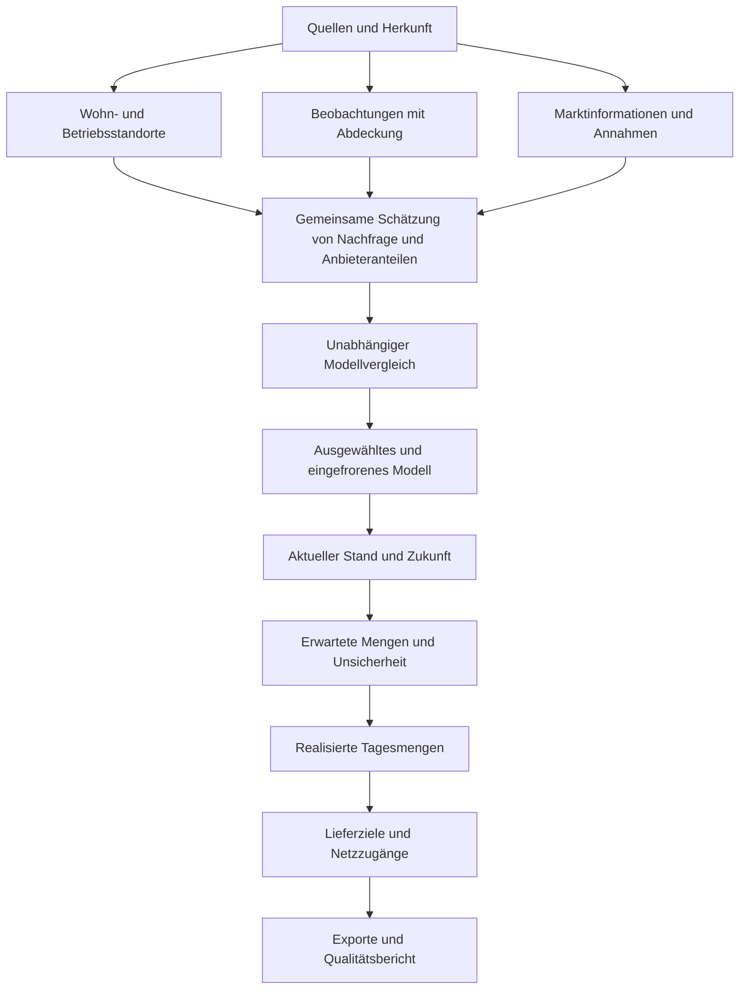

# Gemeinsames Paketnachfragemodell: Gesamtentwurf

**Statusänderung am 15. September 2026:** Der Nutzer möchte zuerst den HAGRID-Grundgedanken als verbesserte Python-Baseline erhalten. Die aktuelle Planungsprüfung und ihre Präzisierungen stehen in [Baseline-Planung](C:/Users/bienzeisler/Documents/GitHub/HAGRID/docs/demand-audit/BASELINE_PLAN_REVIEW_20260915.md). Der folgende Gesamtentwurf dokumentiert die bisherigen experimentellen Modelle; er ist nicht mehr der maßgebliche Baseline-Auftrag. Die Trennung im Python-Code ist noch nicht umgesetzt.

Historischer Stand: 9. September 2026. Dieses Dokument konsolidiert das HAGRID-Audit, die PANDA-Sichtung und die damaligen Methodenentwürfe. Die nachfolgenden Ziele und Umsetzungsangaben beziehen sich auf diesen experimentellen Entwicklungsstand.

**Ziel:** Eingehende Paketnachfrage für die Region Hannover für den historischen Referenzzeitraum, den aktuellen Stand und kommende Jahre schätzen: nach Standort, Empfängersegment, Anbieter und Zeit. Das Ergebnis ist eine zentrale Prognose mit dokumentierten Annahmen und Unsicherheit. Keine bestehende HAGRID- oder PANDA-Formel ist verpflichtend.

**Umsetzungsstand:** Datenfundament, gemeinsame Nachfrage-/Anbieterkalibrierung, Vergleich dreier HAGRID-Merkmalsmodelle, eingefrorene Anwendung, Kalender, räumlich-zeitliche Schwankungen, Zukunftsfortschreibung und Liefer-/GIS-Exporte sind implementiert. Der [Umsetzungsbericht](C:/Users/bienzeisler/Documents/GitHub/HAGRID/hagrid-demand/MODEL_WORKFLOW.md) beschreibt Annahmen und Prüfgrenzen. Die Kalibrierung auf PLZ-Summen ist vorläufig; sie umgeht keine offene Straßenzuordnung durch erfundene Gebäudemessungen. PANDA wurde am Commit `1e683d026cec3483214523280877ef44e012d6d5` gelesen; eine exakte empirische Reproduktion bleibt wegen fehlender Rohdaten/Caches ausstehend. Fachliche Modellfreigabe und technische Lauffähigkeit sind getrennt.

## 1. Festgelegt, vorgeschlagen und noch zu entscheiden

| Status | Inhalt |
|---|---|
| Zielvorgabe | Alle verfügbaren Quellen prüfen und entsprechend ihrer Aussagekraft verwenden; eine nachvollziehbare zentrale Schätzung liefern |
| Architekturentscheidung | Reproduzierbare Python-Stages, unveränderte Rohdaten, versionierte Konfiguration, gemeinsame Vorhersagefunktion für Fit und Export |
| Räumliche Entscheidung | Wohn-/Betriebsstandorte als Kern; kein verpflichtendes Raster; TAZ vorerst ausgeklammert |
| Fachliche Entscheidung | Nachfrageort, tatsächliches Lieferziel, Pakete und Fahrzeugstopps unterscheiden |
| Arbeitsvorschlag | Strukturelles Nachfragepotenzial mit realen Anbieterbeobachtungen und Marktinformationen gemeinsam abstimmen |
| Zu vergleichen | PANDA-Kern, zusätzliche Firmenmerkmale, B2B-/B2C-Anbieterzerlegung, Modellfamilie, Regionalparameter, Zeitmodell |
| Datenabhängig | Zusätzliche Anbieter-Branchenpräferenzen, individuelle Haushaltsrekonstruktion, besondere Großempfänger, frei geschätzte räumliche Effekte |

Die Modellwahl erfolgt nicht über die größtmögliche Zahl an Merkmalen. Ein Datensatz kann für Bestandsprüfung, Kalibrierung, Validierung oder Zukunftsannahmen wertvoll sein, ohne selbst ein Prädiktor zu werden.

## 2. Was genau geschätzt wird

Die primäre Größe ist die Zahl eingehender Pakete. Ausgehende Geschäftssendungen, Retourenabholungen und sonstiger Güterverkehr werden zunächst getrennt gehalten. Vor Kalibrierung werden Marktabdeckung, Eigenzustellung, internationale Sendungen und die Definition von B2B/B2C über die Quellen abgeglichen. Bis zur Klärung lautet die interne Empfängerklassifikation `private | business | unknown`; sie ist nicht automatisch identisch mit jeder veröffentlichten B2B-Definition.

| Produkt | Interpretation |
|---|---|
| Historische Rekonstruktion | Erwartete Nachfrage im exakt definierten Beobachtungszeitraum, einschließlich als solcher gekennzeichneter Messwertanpassung |
| Aktuelle Schätzung | Auf das gewählte Zieljahr fortgeschriebene Nachfrage; 2026 ist ohne neue Messung keine beobachtete Tagesnachfrage |
| Zukunftsprognose | Zentraler Entwicklungspfad und Bandbreiten; alternative Zukunftsannahmen können zusätzlich verglichen werden |
| Realisierte Tagesnachfrage | Zufällige ganzzahlige Ausprägung der erwarteten Nachfrage für Logistiksimulationen |

Die Genauigkeit für DHL, Gesamtmarkt, B2B-Zerlegung und Fremdanbieter wird getrennt angegeben. Ein guter DHL-Fit bestätigt nicht automatisch die übrigen Größen.

## 3. Gemeinsame Datenbasis

Der [Datenkatalog](C:/Users/bienzeisler/Documents/GitHub/HAGRID/docs/demand-audit/DATA_CATALOG.md) führt lokale Inputs, PANDA-Quellen und externe Ergänzungen mit Status und notwendigen Prüfungen auf.

Jede Quelle erhält eine stabile `source_id`, Originalpfad, Hash, räumlichen und zeitlichen Bezug, Einheit, Definition, Herkunft, Zugriffs-/Nutzungsbedingungen und Qualitätshinweise. Einzelwerte werden als `observed`, `synthetic`, `derived`, `assumed` oder `forecast` gekennzeichnet. Herkunftsbeziehungen verbinden abgeleitete Werte mit ihren Inputs.

Besonders wichtig:

- Die alte HAGRID-Nachfrage ist ein Vergleichsergebnis, keine zusätzliche unabhängige Messung.
- HAGRID- und PANDA-Kopien derselben DHL-Quelle werden nur einmal als Information gezählt.
- Personen und Zensus sind alternative/ergänzende Beschreibungen desselben Bevölkerungsbestands; sie werden nicht addiert.
- Firmenpunkte und gewerbliche OSM-POIs können dieselben Betriebe beschreiben; ohne Abgleich entstehen Doppelzählungen.
- Fehlende Beobachtung, erfasste Null und außerhalb der Abdeckung sind verschiedene Zustände.
- Der historische Fit verwendet einen passenden historischen Merkmalsstand. Spätere Daten werden bei fehlenden historischen Merkmalen ausdrücklich als rückwirkender Ersatz markiert.

## 4. Standort- und Beobachtungsmodell

Das Standortverzeichnis verbindet vier Objekte: physischer Standort, Nachfrageeinheit, Lieferpunkt und Netzzugang. Private Nachfrage wird in der ersten Vergleichsversion je Gebäude zusammengefasst; Betriebe bleiben einzelne Einheiten. Eine vollständige Haushaltssynthese ist angesichts der fehlenden Haushaltskennungen kein Pflichtschritt.

Quelle, Lagequalität und Zuordnungsmethode bleiben an jedem Objekt erhalten. Gleiche Koordinaten bedeuten nicht automatisch identische Firmen. Eine Gebäude-ID ist noch kein verifizierter Eingang. Unsichere Fälle werden nicht unbemerkt gelöscht oder gleichmäßig auf Straßen verteilt. Details stehen in der [Aufbereitung ohne Raster](C:/Users/bienzeisler/Documents/GitHub/HAGRID/docs/demand-audit/GRID_FREE_METHOD.md).

Beobachtungen bleiben auf ihrer tatsächlichen Auflösung: DHL-Straße, Hermes-PLZ oder nationales Jahr. Für jeden Beobachtungstyp beschreibt eine Zuordnung A, welche Standorte und Zeiträume er erfasst. Die Vorhersage wird für den Vergleich auf diese Ebene summiert. Zuvor auf Gebäude verteilte Straßensummen werden nicht als unabhängige Gebäudemessungen zum Trainieren verwendet.

## 5. Modellstruktur und Kandidaten

Für Standort i, Segment s und Zeitraum t bezeichnet lambda die erwartete Gesamtmarktnachfrage. Anbieteranteile p summieren sich je Standort/Segment zu 1. Für eine Beobachtung o eines Anbieters c gilt:

`mu_o = sum_i,s A_oi * lambda_i,s,t * p_c|i,s,t`

Für eine echte Zählung ist eine Zählwahrscheinlichkeit möglich; für ein geschätztes Tagesmittel ist eine passende Fehlerbeschreibung erforderlich. Die Beobachtungsdefinition entscheidet über die Verlustfunktion. Standortintensitäten und Anbieteranteile sind mit den verfügbaren Daten teilweise gegeneinander austauschbar. Dokumentierte Ausgangsannahmen begrenzen diese Mehrdeutigkeit; sie werden nicht als gelernte Tatsachen ausgegeben.

### Private und gewerbliche Nachfrage

PANDAs schlankes Bevölkerungs-/Wohnstrukturmodell ist eine Referenz. HAGRIDs Firmen liefern Kandidaten für zusätzliche Branchen- und Beschäftigteneffekte. Zuerst werden wenige gemeinsame Koeffizienten geschätzt, keine freien Paketintensitäten für jeden Standort. Lineare und gedämpfte Betriebsgrößeneffekte sind zu vergleichen. Alters-, Haushalts- oder Mietmerkmale kommen nur bei belegtem zusätzlichem Nutzen hinzu.

PANDA schätzt zunächst auf DHL-Niveau. Seine Koeffizienten dürfen daher nicht ohne Anpassung als Gesamtmarktintensitäten eingesetzt werden. Der Referenzadapter bewahrt zunächst diese Semantik; ein gemeinsames Marktmodell kalibriert die Parameter unter seiner eigenen Beobachtungsgleichung neu.

### Anbieterunterschiede

Die B2B/B2C-Zerlegung verbindet lokale Struktur mit Anbieterprofilen und ist ein besonders sparsamer Kandidat. HAGRIDs B2B-Ausrichtungen und PANDAs Segmentanteile liefern Ausgangswerte mit dokumentierter Herkunft. Sie werden nicht automatisch beide als unabhängige Zielwerte erzwungen.

Bei Gesamtmarktanteil m_c, eigener Anbieter-B2B-Quote q_c und Gesamt-B2B-Quote b gilt für einen konsistenten Markt `sum_c m_c q_c = b`. Daraus folgen für 0 < b < 1 die Segmentanteile `a_c = m_c q_c / b` und `d_c = m_c (1-q_c)/(1-b)`. Lokale Anbieterpakete ergeben sich aus `B_i*a_c + C_i*d_c`. Diese Kandidatenabbildung bewahrt die Mengen und lässt lokale Anbieter-B2B-Quoten variieren. Die [Herleitung](C:/Users/bienzeisler/Documents/GitHub/HAGRID/docs/demand-audit/HAGRID_LSP_REFINEMENT.md) ersetzt keine empirische Auswahl.

Nationale Anteile sind nicht automatisch regionale Wahrheiten. Abweichungen benötigen begründete Spielräume. Zusätzliche Branchenpräferenzen innerhalb eines Anbieters werden nur mit externer Evidenz bzw. explizit begründeten Annahmen aufgenommen. Fehlende Fremdanbieterdaten verhindern nicht die zentrale Schätzung, begrenzen aber die belegbare Genauigkeit.

### Gemeinsame Abstimmung

Das Schätzkriterium kombiniert Fehler echter Beobachtungen mit Abweichungen von unsicheren Marktinformationen und einer Strafe für unnötige Parameteränderungen. Gewichte beziehen sich auf Einheit und Vertrauenswürdigkeit der Quelle. Es gibt keine pauschale Mischung wie 70 % Bottom-up und 30 % Top-down.

Nichtnegative Mengen und Summenidentitäten sind harte Bedingungen. Unsichere nationale Anteile und angenommene B2B-Quoten sind normalerweise weiche Bedingungen. Widersprüchliche harte Vorgaben führen zu einer erklärten Unvereinbarkeit, nicht zu stillen Nachkorrekturen. Ein genetischer Algorithmus ist nicht vorgegeben: Der einfachste geeignete Solver wird anhand des tatsächlich formulierten Teilproblems gewählt.

## 6. Zeit, Zukunft und Logistik

Ein eingefrorenes historisches Modell wird zunächst mit aktualisierten Beständen und belegten Trends auf das aktuelle Jahr übertragen. Bevölkerung, Betriebsbestand, Paketintensitäten und Anbieteranteile besitzen getrennte Entwicklungspfade. Gemeinsame Quellen dürfen Wachstum nicht doppelt auslösen, etwa als nationale Volumensteigerung und nochmals als identischer Intensitätsfaktor.

Jahresmengen werden mit auf den tatsächlichen Kalender normierten Faktoren auf Tage verteilt. Wochen, Feiertage und Schaltjahre müssen zu den Jahresbilanzen passen. Ein langfristiges Tagesmittel reicht nicht zur Schätzung von Tagesstreuung. Ohne geeignete Zeitreihen werden Streuungsparameter als Annahmen ausgewiesen.

Drei Unsicherheiten werden getrennt geführt: Parameter-/Datenunsicherheit, zufällige Tagesschwankung und unbekannte Zukunftsentwicklung. Eine zentrale Prognose wird nicht durch eine Sammlung ungewichteter Szenarien ersetzt. Ohne geeignete Daten sind Bandbreiten Sensitivitätsbereiche, keine nachgewiesen kalibrierten Konfidenzintervalle.

Lieferzielwahl und Bündelung folgen der Nachfrage. Paketstationen erhalten verlagerten Bedarf; sie erzeugen dadurch nicht zusätzliche B2B-Pakete. Belegte Großempfänger werden separat berücksichtigt, aber ein DHL-Ausreißer ist weder automatisch B2B noch ein Großkunde aller Anbieter. Für Logistikvergleiche werden dieselben Nachfrageausprägungen und Zufallsgrundlagen verwendet.

## 7. Vergleich und Entscheidung

Der [Evaluationsplan](C:/Users/bienzeisler/Documents/GitHub/HAGRID/docs/demand-audit/EVALUATION_PLAN.md) legt Kandidaten, Datenaufteilung und Entscheidungskriterien fest. Vergleichsgruppen:

1. Vorhandene HAGRID-Ergebnisse und separat eine minimal reparierte Referenz.
2. Reproduziertes PANDA-Modell mit ursprünglicher Semantik.
3. Schlankes Standortmodell mit HAGRID-Firmenmerkmalen.
4. Gemeinsames Nachfrage-/Anbietermodell, zunächst über B2B/B2C.
5. Einzelne zusätzliche Merkmale oder Effekte als getrennte Erweiterungen.

Eine Erweiterung wird nicht anhand des Trainingsfehlers gewählt. Sie muss auf denselben unabhängigen Beobachtungen bei vergleichbaren Inputs nützen, Mengenbedingungen erfüllen und darf die räumliche Abdeckung nicht heimlich reduzieren. Wo keine direkte Evidenz existiert, wird eine strukturelle Entscheidung als solche begründet; kein künstlicher Gütewert ersetzt fehlende Daten.

## 8. Python-Stages und Datenverträge

Das Paket `hagrid_demand` liegt getrennt von vorhandenen Analyse-/MATSim-Pipelines unter `hagrid-demand`. `foundation` baut das Datenfundament, `run --config hagrid-demand/configs/model.json` führt die gemeinsame Kalibrierungs-/Prognosekette aus, `predict` verwendet ein eingefrorenes Modell. Die folgende Tabelle beschreibt die fachlichen Abnahmekriterien. Ein technisch abgeschlossener Lauf erfüllt nicht automatisch alle datenabhängigen Freigabekriterien.

| Stage | Ergebnis | Abnahmekriterium |
|---|---|---|
| 01 ingest | Quellenmanifest, unveränderte Eingangsdatenreferenzen | Herkunft, Hashes, Bezugsjahre, Einheiten vorhanden |
| 02 audit | Datenqualitätsbericht und zulässige Quellenrollen | Dubletten, Lücken und Definitionskonflikte sichtbar |
| 03 build_sites | Standorte, Nachfrageeinheiten, Zuordnungen | Bestandsbilanzen stimmen; ungelöste Fälle quantifiziert |
| 04 link_observations | Beobachtungstabelle und Zuordnung A | Keine unbeabsichtigte Mehrfachzählung; Messabdeckung erhalten |
| 05 fit_compare | Kandidatenmodelle und externe Vorhersagen | Gleiche Splits; keine Testdaten in Vorverarbeitung/Fit |
| 06 select_freeze | Ausgewähltes Modell, Parameter und Entscheidungsbericht | Auswahl begründet, Annahmen und Prüfgrenzen dokumentiert |
| 07 project | Erwartete Mengen für Referenz-/Zieljahre | Bestands- und Wachstumsannahmen getrennt; Summen konsistent |
| 08 sample_days | Ganzzahlige Tagesrealisierungen | Reproduzierbar; fest vorgegebene Summen werden erhalten |
| 09 delivery | Lieferpunkte und Netzanschlüsse | Umverteilung ohne Mengenverlust; Erreichbarkeit geprüft |
| 10 export_report | Nachfrage, Herkunfts-/Qualitätsbericht, Adapterexporte | Exportbilanz stimmt mit Modell; Feldsemantik geprüft |

Kernobjekte: `sources`, `sites`, `demand_units`, `observations`, `observation_links`, `market_constraints`, `model_parameters`, `expected_demand`, `realized_demand`, `delivery_points`. Jede Menge trägt Einheit, Zeitbezug, Segment, Anbieter und Run-ID. Fehlende Anbieter-/Segmentinformation wird explizit dargestellt.

Vorgesehene Bedienung: ein Befehl für einen vollständigen Lauf, zusätzlich Einstieg in einzelne Stages und Wiederaufnahme. Fit/Modellvergleich und reine Anwendung sind getrennte Modi. Ein Prognoselauf kalibriert nicht unbemerkt neu. Abhängige Caches werden bei Änderungen an Daten, Konfiguration oder Code ungültig. Fehler stoppen abhängige Stages mit verständlicher Ursache.

Jeder Lauf speichert Konfiguration, Codeversion, Input-Hashes, Paketversionen, Seeds, Prüfresultate, Modellwahl und Outputbilanzen. Fachliche Konfiguration, Python-Module und optionale Notebook-Auswertung sind getrennt. Vorhandene MATSim-Exports werden über einen expliziten Adapter bedient; `_tag`/`_type` werden anhand des tatsächlichen Konsumenten geprüft und nicht nach alten Kommentaren interpretiert.

## 9. Umsetzung in überprüfbaren Lieferungen

**A — Datenfundament:** Quellmanifest, Bestandsprüfung, Standortverzeichnis und Beobachtungszuordnung implementieren. Ohne diesen Schritt wird kein komplexer Fit gestartet. Historische Messdefinitionen können zunächst als offen registriert werden; die abhängige absolute Kalibrierung bleibt bis zur Klärung gesperrt.

**B — Historischer Vergleich:** Verfügbare HAGRID- und PANDA-Referenzen auf eine gemeinsame Bewertung bringen. Fehlende PANDA-Daten anhand des Katalogs beschaffen bzw. vorhandene identische Quellen zuordnen. Eine angepasste Reproduktion von der exakten Referenz unterscheiden.

**C — Zentrales Modell:** Schlanken Kandidaten wählen, Firmen- und Anbieterbausteine kontrolliert ergänzen, Modell einfrieren. Auswahlbericht enthält auch verbleibende Annahmen und Fälle ohne unabhängige Validierung.

**D — Gegenwart und Zukunft:** Bestand und Zeitmodell fortschreiben, Tagesmengen erzeugen, Bandbreiten und Kalenderbilanzen prüfen.

**E — Integration:** Zustellstrategie und MATSim-Adapter anbinden, einen vollständigen reproduzierbaren Lauf abnehmen. Erst dann ersetzt das neue Modell den bisherigen Demand-Workflow.

Die Kernstages sind inzwischen ausführbar. Die aktuelle Kalibrierung nutzt PLZ-Beobachtungen unter expliziten Arbeitsannahmen; die ungeklärten Straßenlinks bleiben Kandidaten. Messdefinitionen und Quellenjahre sind weiterhin Voraussetzung einer fachlichen Freigabe. Die vollständige PANDA-Reproduktion, unabhängige Segmentvalidierung und ein tatsächlicher MATSim-Tourenlauf stehen mangels Daten bzw. als nachgelagerte Prüfung aus; der [Umsetzungsbericht](C:/Users/bienzeisler/Documents/GitHub/HAGRID/hagrid-demand/MODEL_WORKFLOW.md) grenzt dies ab.

## 10. Belege und Lesereihenfolge

1. Dieser Gesamtentwurf, danach [Datenkatalog](C:/Users/bienzeisler/Documents/GitHub/HAGRID/docs/demand-audit/DATA_CATALOG.md) und [Evaluationsplan](C:/Users/bienzeisler/Documents/GitHub/HAGRID/docs/demand-audit/EVALUATION_PLAN.md).
2. [HAGRID-Audit](C:/Users/bienzeisler/Documents/GitHub/HAGRID/docs/demand-audit/AUDIT.md) und [Prüfbericht](C:/Users/bienzeisler/Documents/GitHub/HAGRID/docs/demand-audit/verification.json) für reproduzierte Defekte und Datenprofile.
3. [PANDA-Sichtung](C:/Users/bienzeisler/Documents/GitHub/HAGRID/docs/demand-audit/PANDA_HAGRID_CONCEPT.md), [Standortmethodik](C:/Users/bienzeisler/Documents/GitHub/HAGRID/docs/demand-audit/GRID_FREE_METHOD.md) und [LSP-Herleitung](C:/Users/bienzeisler/Documents/GitHub/HAGRID/docs/demand-audit/HAGRID_LSP_REFINEMENT.md) als Detailmaterial. Dort formulierte Modellpräferenzen sind durch die Auswahlregeln dieses Gesamtentwurfs eingeordnet.
